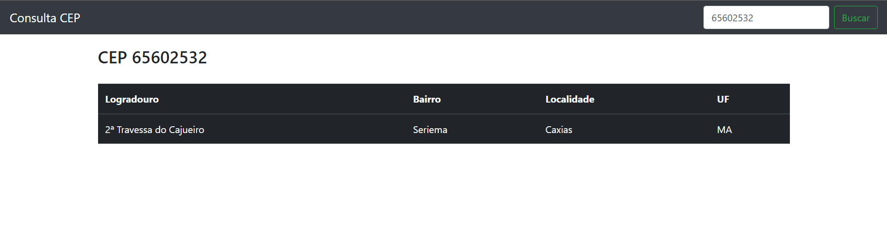

<h1 align="center">
  
</h1>

  <a href="#objetivo">Objetivo</a> • 
  <a href="#tecnologias">Tecnologias</a> • 
  <a href="#autor">Autor</a> • 
  <a href="#license">License</a>

<h1 id="objetivo"> Sistema: Aula Jquery Ajax </h1>

Aula prática do curso: Introdução ao jQuery e Ajax da Digital Innovation One
> Esse é um sistema bem simples que busca informações do seu logradouro conforme o CEP pesquisado, mostrando as informações organizadas em tabela estilizada com Bootstrap.

> Link da execução em tempo real do projeto: <a href="https://buscar-logradouro.netlify.app/" target="_blank">https://buscar-logradouro.netlify.app/</a>

<h2 id="tecnologias"> 🛠 Tecnologias </h2>

As seguintes ferramentas foram usadas na construção do projeto:

-  [HTML5](https://www.w3schools.com/html/)
-  [CSS3](https://www.w3schools.com/Css/)
-  [JavaScript](https://www.javascript.com/)
-  [Jquery](https://jquery.com/)
- [Ajax](https://www.w3schools.com/xml/ajax_intro.asp)
-  [Bootstrap](https://cdn-icons-png.flaticon.com/512/5968/5968672.png)

## Autor

<a href="https://github.com/Kaua-Felipe">
 
  
 
   <b>Kauã Felipe</b>
 
</a> 
<a href="https://github.com/Kaua-Felipe" title="User Kauã Github">🚀</a>

Feito com ❤️ por Kauã Felipe 🚀🚀🚀

 

## License
Este projeto pode ser usado por qualquer um! Licença <a href="https://github.com/Naereen/StrapDown.js/blob/master/LICENSE">MIT</a>
